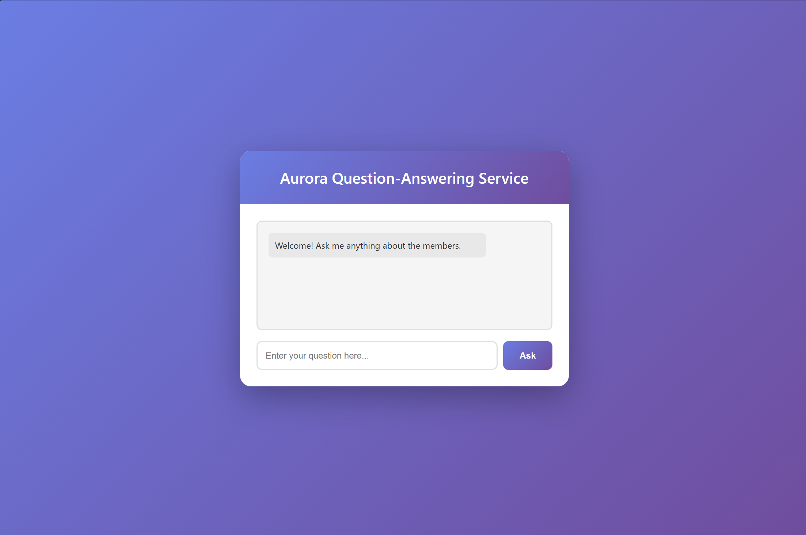
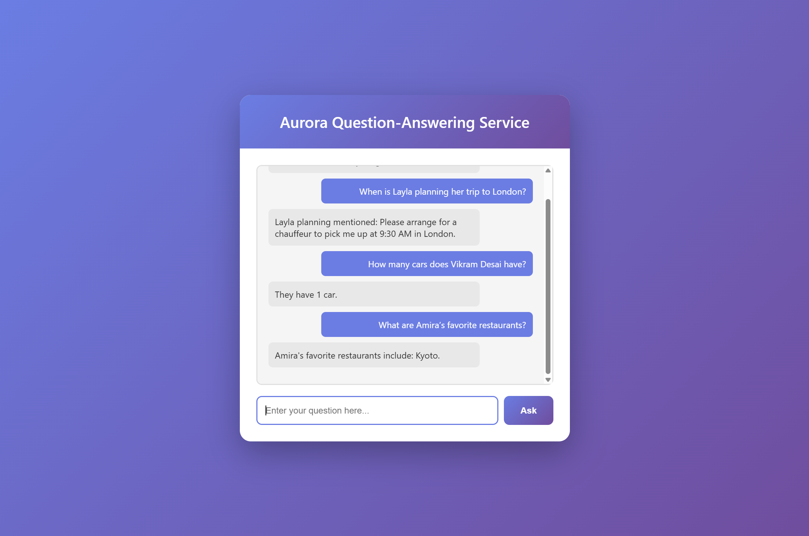
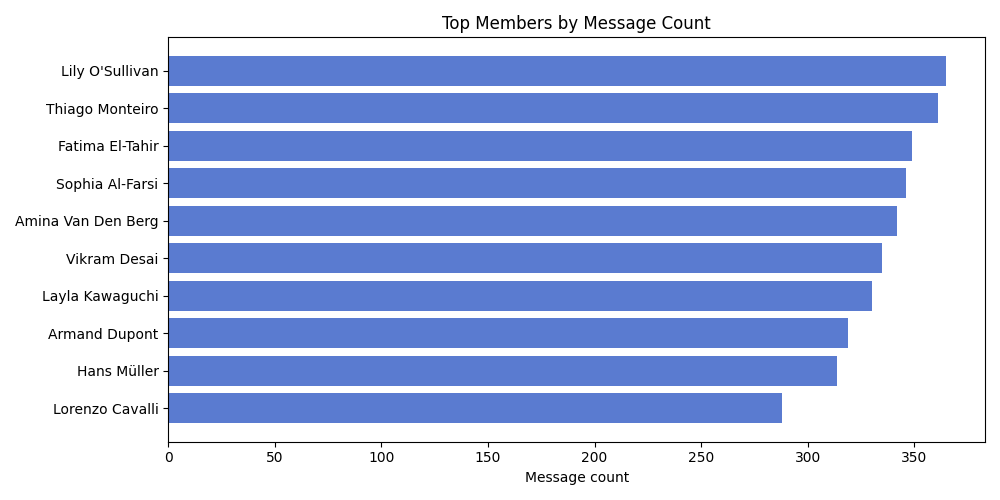
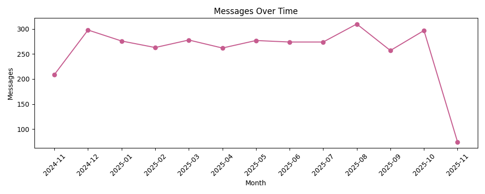
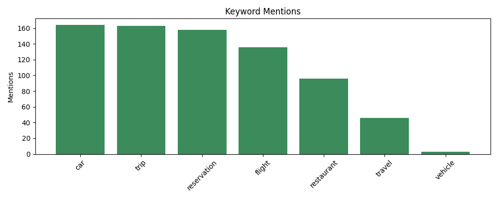
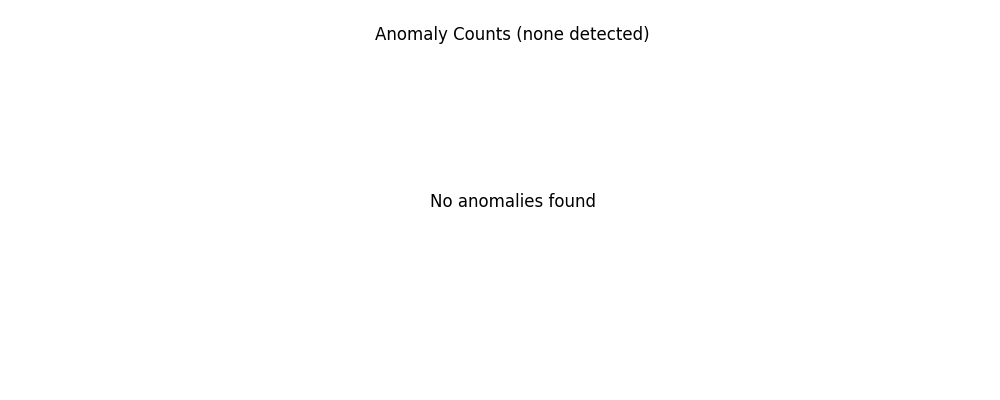

## Member QA Service (FastAPI)

A question-answering API that inspects member chatter from the public `/messages` endpoint and returns responses such as:

- “When is Layla planning her trip to London?”
- “How many cars does Vikram Desai have?”
- “What are Amira’s favorite restaurants?”

The implementation combines a TF-IDF retriever with lightweight heuristics for dates, numbers, and restaurant names. When extraction fails, the service returns the most relevant supporting message instead.

### Public Data Source

- Messages API: `https://november7-730026606190.europe-west1.run.app/messages`
- Docs: `https://november7-730026606190.europe-west1.run.app/docs#/default/get_messages_messages__get`

### API

- `GET /ask?question=...`  
  Response:
  ```json
  { "answer": "..." }
  ```
- `GET /health`

### Deliverables

- `/ask` endpoint that returns `{"answer": "..."}` in JSON.
- `/health` readiness endpoint.
- Render deployment using `aurora-qa` (see `render.yaml` and Dockerfile).
- Dataset refresh script (`app/fetch_all_messages.py`) plus analyzer (`app/analyze_data.py`) that output the analytics JSON and charts into `data/` and `reports/`.
- Data directory with the message dumps (`data/messages_full.json`, `data/messages_fetch_full.json`) and the latest analytics snapshot (`data/data_insights.json`).
- Pytest suite (`test_api.py`) that exercises the HTTP endpoints.

### Examples

- “When is Layla planning her trip to London?”
- “How many cars does Vikram Desai have?”
- “What are Amira’s favorite restaurants?”

### Deployed URL (Render)

You can try the service live at: `https://aurora-qa-qncl.onrender.com/`

Demo video: `https://youtu.be/eV0YeiZ3OSU`

### UI Screenshots

These screenshots show the small chat-style web UI that sits on top of the FastAPI backend:





This service uses a TF‑IDF retriever on top of the messages, with light heuristics to extract dates, counts, and restaurant names for common question types. It falls back to returning the most relevant supporting message if no direct extraction succeeds.

---

## Local Development

1. Create a virtual environment and install dependencies:
   ```bash
   python -m venv .venv
   .venv\Scripts\activate  # Windows
   pip install -r requirements.txt
   ```
2. Run the server:
   ```bash
   python main.py
   ```
3. Try the API:
   ```bash
   curl "http://localhost:8000/ask?question=When is Layla planning her trip to London?"
   ```
4. Access interactive docs at `http://localhost:8000/docs`
5. Run the data analyzer (writes `data/data_insights.json` and regenerates the charts):
   ```bash
   python app/analyze_data.py
   ```
6. (Optional) Refresh the full message dump by hand (writes to `data/messages_fetch_full.json`):
   ```bash
   python app/fetch_all_messages.py --delay 1
   ```
   This script is mainly for manual control or local analysis runs—`app/retriever.py` already calls the same logic on startup and every 30 minutes, so the service keeps the dump fresh by itself.

---

## Testing

Run `pytest test_api.py` to exercise the `/health` and `/ask` flows. The test file includes print statements so you can see what scenario is running and verify that requests succeeded.

---

## Deployment (Render - Docker)

This repo includes a `Dockerfile` and `render.yaml` for a one-click Render deploy.

Steps:
1. Push this repo to GitHub.
2. In Render, create a new Web Service from your repo.
3. Choose Docker environment. Render will auto-detect `Dockerfile`.
4. Expose port `8000`. Health check path: `/health`.
5. Deploy. Your public URL will serve `/ask`.

Alternative hosts (also work with the Dockerfile):
- Railway, Fly.io, Google Cloud Run, Azure Container Apps.

### GitHub + Render workflow

1. Push your branch to `https://github.com/<your-username>/aurora-qa.git`.
2. Connect that repository in Render; it reads `render.yaml` and knows to run the `aurora-qa` service.
3. Render builds the Docker image, runs the container on port 8000, and exposes `/ask`.
4. Render’s free tier may ask for a credit card to prevent abuse, but no charges occur unless paid features are enabled.
5. After each GitHub push, Render redeploys automatically.

---

## Design Notes (Bonus 1)

I explored several strategies for building the QA capability:

1. **TF‑IDF retrieval + heuristics (implemented)**  
   The service uses TF‑IDF to surface the most relevant messages and then applies regex/keyword heuristics in `app/qa.py` to extract dates, numbers, or restaurant names. Under the hood, the retriever builds a TF‑IDF index over all member messages, which basically turns each message into a “bag of words” vector and scores how well it matches the question. That gives us a small set of highly relevant messages in a few milliseconds, without any external APIs or heavy ML models. On top of that, `app/qa.py` runs simple rules: regexes to pull out dates, a small window around “car/cars/vehicle” to count cars, and proper‑noun extraction to guess restaurant names. If those patterns don’t fire, it just returns the top supporting message verbatim so the answer is always grounded in a real member message.

2. **TF‑IDF retrieval + a local slot-filling model**  
   Could capture structured elements (dates, numbers) without calling external services. This would add model artifacts and require tuning, so I avoided it in favor of straightforward heuristics.

3. **Embedding-based retrieval (Sentence Transformers)**  
   Offers stronger semantic matching and paraphrase handling, but leaves you downloading ~90–100MB of model weights, spending 1–3 seconds at startup, and using more RAM. For a small, well-structured dataset like this one, TF‑IDF gives you similar rankings with far less startup cost and operational complexity.

4. **Managed LLM (OpenAI/Anthropic)**  
   Has the most natural responses, but needs API keys, incurs cost, and complicates a free public deployment. The assignment requirements did not ask for external APIs or paid services.

Given the small dataset, simple question types, and deployment constraints, TF‑IDF plus targeted heuristics is the best balance of speed, cost, and explainability. It handles the example questions reliably while still being easy for reviewers to understand and debug.

---

## Data Insights (Bonus 2)

Run the analyzer to produce a concise JSON summary and visualizations:
```bash
python app/analyze_data.py
```

`app/analyze_data.py` now loads `data/messages_fetch_full.json` (3,349 records generated by `app/fetch_all_messages.py`). If that dump is being rebuilt or missing, the script falls back to `data/messages_full.json` and then to a smaller local snapshot if needed, so you always have something to analyze. The pagination helpers remain available if you prefer to stream directly (`ANALYZE_USE_API=1`).

Snapshot recorded in `data/data_insights.json` (current run using `messages_fetch_full.json`):

- Total messages: 3,349  
- Unique members: 10  
- Members with more than 10 messages: Sophia Al-Farsi, Fatima El-Tahir, Armand Dupont, Hans Müller, Layla Kawaguchi, Amina Van Den Berg, Vikram Desai, Lily O'Sullivan, Lorenzo Cavalli, Thiago Monteiro  
- Empty content messages: 0  
- Messages containing dates: 237  
- Car count conflicts: none  
- Member message distribution: JSON array of counts per member (feeds `reports/messages_by_member.png`):

  

  This shows which members are most active (Lily, Thiago, Fatima near the top) and confirms that activity is spread across all ten identities rather than dominated by just one.

- Monthly message counts: timeline entries that feed `reports/messages_timeline.png`:

  

  You can see planning spikes around December and August, with a drop in the most recent partial month because the dataset stops in mid‑November.

- Keyword mention totals: counts for cues the heuristics track (`trip`, `restaurant`, `car`, etc.) and visualized in `reports/keyword_coverage.png`:

  

  This chart confirms that “car”, “trip”, “reservation”, and “flight” appear often enough to justify the heuristics and that “vehicle” is relatively rare.

- Anomaly breakdown: counts for missing names/timestamps, repeated text, or extra‑long messages plus sample details in `reports/anomaly_histogram.png`:

  

  Even when the dataset looks clean (few anomalies), the chart documents that we checked for outliers before relying on the corpus for QA.

All four charts live in `reports/`. If you need a fresh copy of `data/messages_fetch_full.json`, run `python app/fetch_all_messages.py --delay 1`; the script resumes from the last run, respects rate limits, and appends only new IDs. Re‑run `python app/analyze_data.py` afterward to regenerate the charts and JSON.

---

## Notes

- Caching: `app/retriever.py` refreshes `/messages` data every 30 minutes. Each refresh runs `fetch_all_messages.fetch_all`, so it rebuilds `data/messages_fetch_full.json` but still serves `data/messages_full.json` (the older dump) if the new copy is unavailable during startup.
- Fallbacks: If heuristics fail to extract structured answers, the service returns the most relevant supporting message text.
- Testing: `pytest test_api.py` exercises both `/health` and `/ask`.


